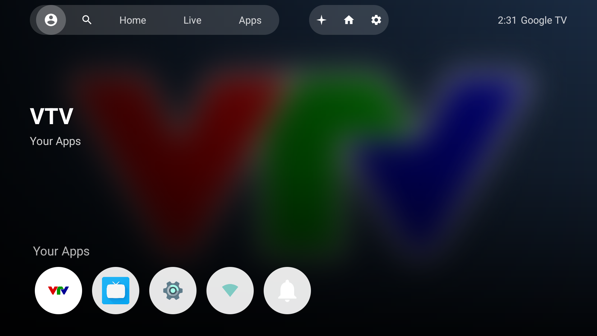
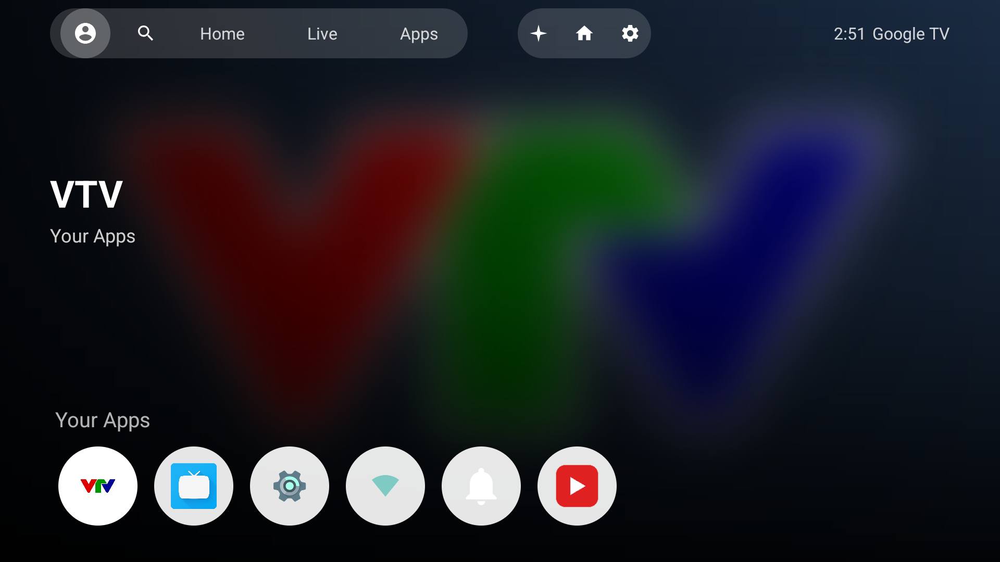
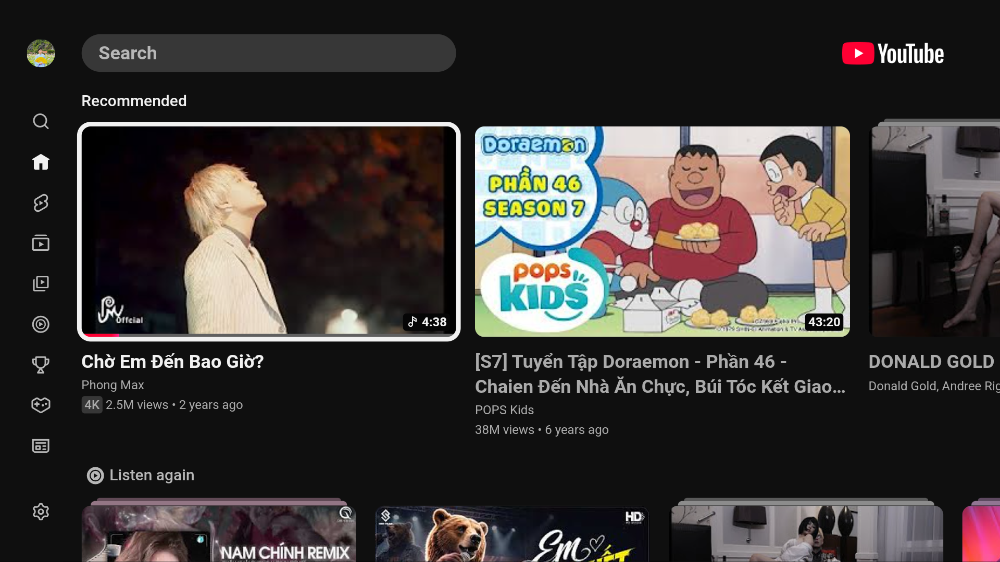
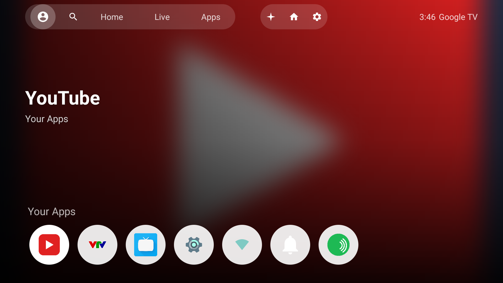
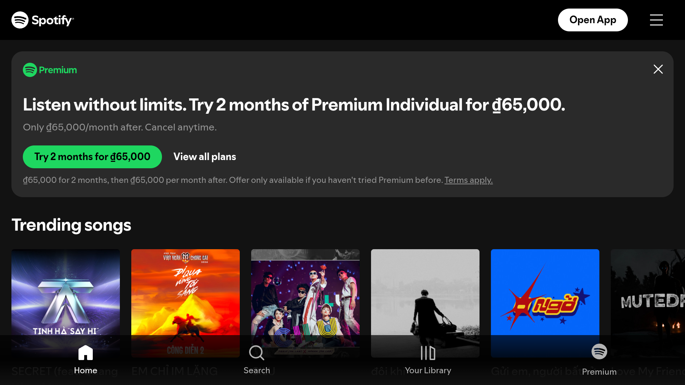
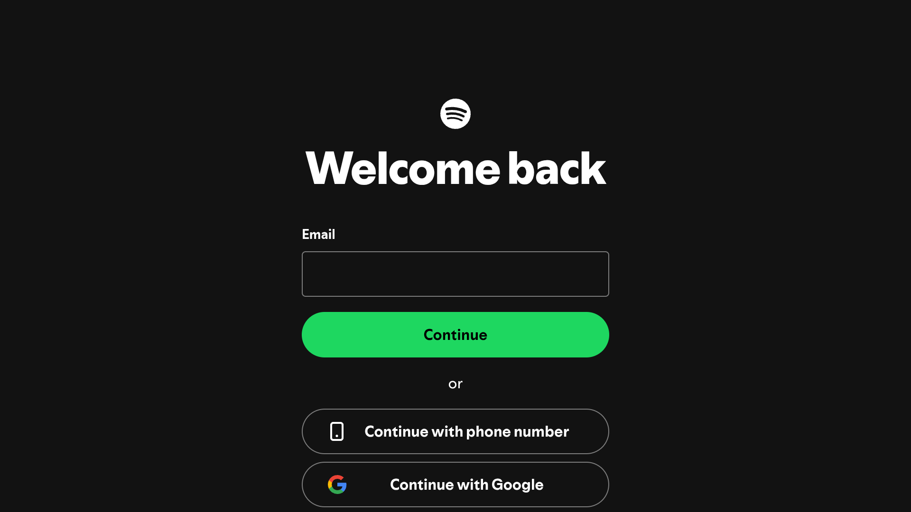
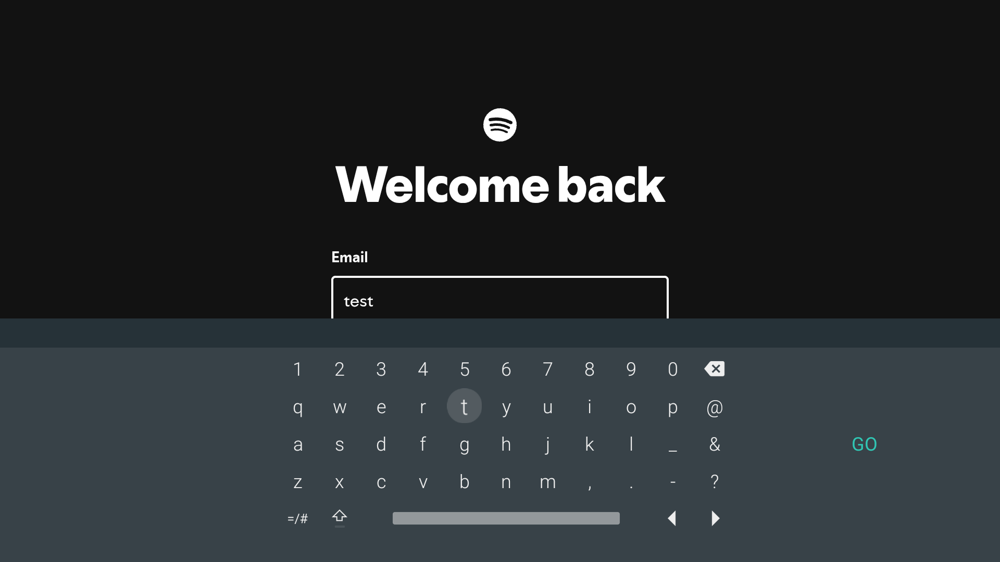

# Android TV for Raspberry Pi 4 (AOSP 16, `aosp_rpi4_tv`)

Patch set for **AOSP's `aosp_rpi4_tv` product** -- the stock Android TV
(Leanback) build that AOSP already ships for the Raspberry Pi 4
(`device/brcm/rpi4`), on top of Google's reference TV device tree
(`device/google/atv`). This repo does **not** carry a full device tree copy;
it tracks the local fixes/customizations applied on top of a stock
`android-16.0` checkout, as patches against the exact AOSP paths they touch,
plus wholly new apps (`packages/apps/VtvTvInput`, and the app-row entries
added later) kept as plain file copies since there's no upstream version of
them to diff against.

This is a sibling project to
[Android-Auto-for-Pi4-Android-16](../Android-Auto-for-Pi4-Android-16) (the
`aosp_rpi4_car` build on the same board) -- same hardware, different AOSP
product/form-factor.

## Status

**Fixed:**
- Wi-Fi icon on the home screen showed `<unknown ssid>` even while
  genuinely connected with a good signal. See below.
- The stock launcher (`TvSampleLeanbackLauncher`) never showed newly
  installed launchable apps (Live Channels, this repo's own VTV app) on the
  home screen at all. See below.

**Added:**
- Live TV: the free-to-air VTV1-9 national channels, watchable two ways --
  as regular channels inside AOSP's stock Live Channels app, and via a
  small standalone channel-picker app. See below.
- Home screen re-skinned to a Google TV Home style layout (top nav bar,
  focus-driven hero background, a single circular app-icon row). See below.
- YouTube, added to the app row -- a WebView wrapper, since this AOSP
  build has no GMS/Play Services to run the real app. See below.
- Spotify, added to the app row the same way. Rougher than YouTube --
  Spotify has no TV-remote-oriented web client, see below for the caveats.

## Feature: home screen re-skin (Google TV Home style)

### What it does
Re-skins the stock `TvSampleLeanbackLauncher` home screen to look and
behave like Google TV Home, using only real on-device data (installed
apps, their icons/banners) -- not a pixel-perfect clone of the
closed-source Google TV Home app, and no fabricated "Top picks for you"
content (that would need a real recommendation source publishing
`TvProvider` `PreviewProgram`s, which is future work, not this repo).

- **Top bar**, fixed above everything: an account-avatar stand-in + Search
  icon + Home/Live/Apps tabs in one translucent pill capsule on the left
  (focus moves a solid white pill between them, not a fixed "current
  page" indicator); a second capsule on the right with
  assistant/home/Settings icons; a clock + brand text on the far right.
  "Live" launches the real Live Channels activity
  (confirmed via `adb shell cmd package query-activities`, not guessed).
- **Hero region**: a full-screen ambient-blurred backdrop
  (`RenderEffect.createBlurEffect`, API 31+) that tracks whichever app
  icon currently has D-pad focus, with its label/banner as the title.
- **App row**: every launchable app (regular apps + Settings/Network/
  Notifications) merged into one circular icon row pinned to the bottom
  of the screen, de-duplicated by target component (Android TV Settings
  legitimately declares itself as both an app and a settings shortcut).

| | |
|---|---|
|  | Hero background follows D-pad focus; one circular app row at the bottom, matching a real Google TV Home screenshot's layout rather than the stock launcher's stacked square-tile rows. |

### Real bugs hit building this, and their fixes

**1. Icons randomly vanished after launching any app and returning home.**
Root cause: `LaunchItem.areContentsTheSame()` (a `SortedList` diff
callback) compared `Drawable` icons with `Objects.equals()`, which is
always `false` since `Drawable` doesn't override `equals()`. Every list
rescan (triggered on every app launch) therefore looked like every item
"changed", triggering `RecyclerView`'s default cross-fade animation --
which got cut off mid-flight when the Activity paused because an app was
launching, leaving the icon's alpha stuck near 0. Fixed by dropping the
`Drawable` comparison from `areContentsTheSame()` and defensively
resetting alpha/scale in `AppViewHolder.bind()` regardless of what an
in-flight animator left behind.

**2. Two-layer background seam.** The first blurred-backdrop
implementation kept a sharp, hero-region-only image layered separately
from a full-screen blurred one behind it, producing a visible hard seam
where the sharp box ended. Fixed by removing the hero region's own image
entirely -- there is now exactly one full-screen `ImageView`, blurred, with
the hero title/subtitle just positioned as text over it.

**3. D-pad `DPAD_CENTER` focus didn't visually indicate on 4 of the top
bar's buttons** (Search/assistant/home-button/Settings): they only had the
default `?android:attr/selectableItemBackground` ripple, invisible on a
real TV remote. Fixed by giving them the same white-circle-on-focus
treatment the app tiles already had, reusing the same drawable so the
focus language is consistent everywhere on screen.

**4. Proportions can't be eyeballed from a screenshot at face value.**
Asked to match a reference screenshot's proportions, sizes were measured
as **fractions of width/height** (not absolute px, since a shared
screenshot's native resolution is unknown) and re-applied to this
device's real 1920x1080 screen. That process caught a real layout bug,
not just a sizing one: the gap between the two top-bar button groups used
a flexible `layout_weight="1"` spacer, identical to the one before the
clock -- two equal flexible gaps centered the right button group in the
middle of the bar instead of tight against the left group like the
reference. Fixed with a fixed-width spacer between the groups, leaving
only the clock-side gap flexible.

### Result (verified on real hardware)
Screenshots + `adb shell uiautomator dump` D-pad focus traces on the real
device, not just build success, across every round of changes: hero
background updates on focus change with no seam, all top bar buttons show
a clear focus indicator, the app row never loses an icon after returning
from a launched app, and everything fits one 1920x1080 screen with no
scrolling.

## Feature: YouTube

### What it does
Adds a "YouTube" icon to the launcher's app row. This AOSP build has no
GMS/Play Services, so the real closed-source YouTube app (which also
needs Google TV certification) can't be built or installed here. Instead
`packages/apps/YouTubeTv` is a thin WebView wrapper around
`https://www.youtube.com/tv` -- YouTube's own official web client built
for TV remotes/D-pads (the same URL Chromecast/older Google TV boxes'
web-based clients used before a native app existed), not a scrape or
reverse-engineered client.

| | |
|---|---|
|  | Shows up in the app row automatically -- it just declares the `LEANBACK_LAUNCHER` category like any other app; no launcher-side changes needed. |
|  | youtube.com/tv's real home feed, D-pad navigable out of the box. |
|  | Real playback, not just the landing page -- ads, then the selected video. |
|  | BACK returns to YouTube's own home screen first, matching how the real app behaves (see the BACK-button bugs below for why that took more than it looks). |

### Real bugs hit building this, and their fixes

**1. BACK exited the whole app on the first press**, instead of going
back within the page. Root cause: this app targets a modern SDK, so the
platform's default Predictive Back callback intercepts `KEYCODE_BACK`
before `Activity.onKeyDown()` ever sees it and just finishes the Activity
outright. Fixed with `android:enableOnBackInvokedCallback="false"` in the
manifest, opting back into the legacy dispatch.

**2. `WebView.canGoBack()`/`goBack()` (even jumping several history steps
at once via `goBackOrForward()`) turned out to be fundamentally the wrong
tool for this site, not just slow.** youtube.com/tv is a single-page app;
some screens (e.g. "Add your Google Account") are a client-side
route/overlay change with no real browser-history entry at all, so
`canGoBack()` was `false` even though the page had its own "back" to do.
Worse, even when a history entry *did* exist, jumping straight to it via
`goBackOrForward()` was unreliable: the URL/`WebBackForwardList` updated
correctly but the page's own client-side router didn't always repaint to
match, confirmed on-device repeatedly with waits up to 6 seconds -- not a
one-off, it reproduced across multiple separate attempts. The reliable
fix ended up being to not touch WebView history at all: compare the
current URL against the home URL (accounting for youtube.com/tv's
hash-based routing, e.g. `#/watch?v=...`, where the path stays constant
and only the fragment changes) and force a real `WebView.loadUrl()` back
to the home URL when not already there -- a full navigation the page
can't fail to react to. A defensive Escape-key dispatch (the convention
TV-oriented JS apps listen for from a remote's Back button) stays as a
fallback for the no-URL-change overlay case, with a "press back again to
exit" double-tap safety net for when there's truly nothing left to do.

### Result (verified on real hardware)
Real playback confirmed (not just the landing page): opening a
recommended video plays a skippable ad, then the video itself, with
audio, tracked via `cr_MediaCodecBridge`/`MediaCodec` log lines. BACK
tested repeatedly (3 separate trials, each from a freshly opened video,
with waits up to 10s before checking): 1 press reliably returns to
YouTube's own home screen, a 2nd press reliably exits to the launcher --
confirmed via `dumpsys window`'s `mCurrentFocus` at each step, not just a
screenshot glance.

## Feature: Spotify

### What it does
Adds a "Spotify" icon to the app row, same reasoning as YouTube: no GMS
on this AOSP build, so the real app isn't buildable/installable here.
`packages/apps/SpotifyTv` is a WebView wrapper around
`https://open.spotify.com`. Unlike YouTube, **Spotify has no dedicated
TV-remote-oriented web client** -- this is expected to be, and is, rougher
than YouTubeTv: the web player is built for mouse/keyboard/touch, and
"Sign in with Google/Facebook" is likely blocked inside an embedded
WebView (Google's OAuth explicitly detects and rejects the WebView user
agent). Spotify's own direct email/password login is expected to reliably
work.

| | |
|---|---|
|  | Both YouTube and Spotify in the app row -- same `LEANBACK_LAUNCHER` mechanism, no launcher changes for either. |
|  | open.spotify.com's real logged-out landing page, region-appropriate trending content. |
|  | Reached via the hamburger menu -> "Log in"; the real login form renders correctly, including "Continue with phone number"/"Continue with Google". |
|  | Typing into the email field works -- the on-screen keyboard (IME) pops up and input lands correctly. |

### Notable differences from YouTubeTv
- **User agent**: strips `"; wv"` (the literal WebView marker Chrome's
  default UA includes) rather than appending a TV hint like YouTubeTv
  does -- Spotify has no alternate TV site to branch to via UA, so the
  only lever here is making a "Sign in with Google" attempt look less
  like an embedded WebView to Google's own OAuth check.
- **BACK's `isHomeUrl()` check is path-based, not hash-based**:
  open.spotify.com uses normal path routing (`/search`, `/playlist/xyz`),
  not youtube.com/tv's hash fragments (`#/watch?...`), so home is
  identified by an empty/`/` URL path instead of an empty/`/` hash.
- Reuses the exact same BACK-handling design as YouTubeTv otherwise
  (predictive-back opt-out, force-navigate-to-home on BACK, Escape-key
  fallback, double-back-to-exit) rather than rediscovering those bugs
  again here.

### Result (verified on real hardware)
Landing page loads with real, region-appropriate trending content; the
hamburger menu and login form are reachable and functional, including
on-screen-keyboard text entry into the email field. **Not yet verified**:
an actual login with a real account, and audio playback after signing in
-- left for whoever has a Spotify account to test next.

## Feature: VTV live TV channels

### What it does
Plays the free-to-air VTV1-9 HLS (m3u8) live streams. Two ways to watch:

1. **Inside Live Channels** (`packages/apps/TV`, built as
   `LiveTvNonPassthrough`, not part of this repo -- it's stock AOSP, just
   not enabled by default on this product): a `TvInputService`
   (`VtvTvInput`) registers VTV1-9 as channels; Live Channels' own "add
   channel source" flow makes them browsable, then they behave like any
   other channel (EPG row, channel-surf, etc).
2. **Standalone**: the `VtvTvInput` app itself has a launcher icon. Opening
   it shows a 3x3 grid of channel tiles; picking one opens a fullscreen
   player. `CHANNEL_UP`/`DOWN` or D-pad left/right switch channels without
   leaving the player; back returns to the grid.

Playback uses plain `android.media.MediaPlayer` (the framework's NuPlayer
already speaks HLS) -- no ExoPlayer/media3 dependency pulled into the
build. Each channel lists two mirror URLs (a primary and a fallback); on a
`MediaPlayer` error it walks to the next one automatically.

Stream URLs come from the public, community-maintained
[iptv-org/iptv](https://github.com/iptv-org/iptv) playlist (`streams/vn.m3u`,
CC0), which aggregates freely available, non-DRM live streams of these
terrestrial free-to-air channels. CDN mirror endpoints for IPTV drift over
time; if a channel stops loading, that's the file to check
(`packages/apps/VtvTvInput/src/com/rpi4tv/vtvinput/VtvChannels.java`).

### Real bugs hit building this, and their fixes

**1. `TvProvider` `SecurityException: Not allowed to access
Channels.COLUMN_BROWSABLE`.** `TvInputService`s are only allowed to insert
their own channel rows; only a caller holding the privileged
`ACCESS_ALL_EPG_DATA` permission (i.e. Live Channels itself) may set
`browsable`. `VtvSetupActivity` used to set it on insert and crashed. Fixed
by not setting it at all -- the channels land `browsable=0`, and Live
Channels' own "select channels" UI is what's supposed to flip it, which is
also how any real `TvInputService` is meant to behave.

**2. Newly added apps never appeared on the Home screen at all**, Live
Channels included -- not specific to this app, a pre-existing gap in the
stock `TvSampleLeanbackLauncher`. Root cause: Android's package-visibility
filtering (API 30+). This AOSP version has **no automatic exemption for the
default Home app** (checked: no HOME-role carve-out in
`frameworks/base/services/core/java/com/android/server/pm/AppsFilter*`);
`TvSampleLeanbackLauncher`'s manifest had no `<queries>` block, so
`PackageManager.queryIntentActivities(MAIN + LEANBACK_LAUNCHER)` in its own
`LaunchItemsManager.updateAppList()` silently returned nothing for any app
the launcher hadn't already "interacted with". Confirmed via
`adb shell dumpsys package com.example.sampleleanbacklauncher` (see its
`Queries:` section) both before and after the fix. Fixed by adding a
`<queries>` block declaring the exact intents `LaunchItemsManager` queries
(also folded into this repo's `AndroidManifest.xml.patch`, alongside the
older Wi-Fi SSID fix below).

**3. `GridView` + `ArrayAdapter` never fired clicks on `DPAD_CENTER`/`ENTER`**
for the channel-picker grid, even with the item view's own
`OnClickListener` *and* `OnKeyListener` both wired up -- confirmed via
logcat that neither was ever invoked for the key event, while touch taps on
the same tiles worked fine and the D-pad focus ring rendered correctly.
Root cause not fully pinned down (suspected `AbsListView`'s own
`DPAD_CENTER` handling for its internal selection model, which only calls
`performItemClick()` -- a no-op without `setOnItemClickListener`, which was
intentionally not used here in favor of per-tile listeners). Fixed by
dropping `GridView` entirely for a plain `GridLayout` with the 9 tiles
added as direct children in code; D-pad OK then follows the standard
View-focus-to-`performClick()` path with no special handling needed.
Lesson for next time: avoid `GridView`/`AbsListView` for custom D-pad item
UIs on this tree -- a plain `ViewGroup` with real child `View`s is the
reliable pattern.

### Result (verified on real hardware, 2026-08-10)
- `dumpsys tv_input` shows the input registered; `VtvSetupActivity` inserts
  all 9 channels with no crash (checked directly against
  `/data/user/0/com.android.providers.tv/databases/tv.db` over adb root).
- Live Channels lists a "VTV" channel source with all 9 channels by name;
  after marking them browsable, VTV1/2/3/5/9 were each tuned and confirmed
  playing real video+audio, channel-surfing between them promptly.
- The standalone grid: D-pad navigates correctly, `DPAD_CENTER` opens the
  player and starts real playback, `DPAD_RIGHT` mid-episode steps to the
  next channel correctly, `BACK` returns to the grid.
- The primary CDN mirror worked on the first try for every channel tested
  from a Vietnam IP; no `Referer`/`User-Agent` gating was observed.

### Known constraint
`system.img` for this product lands at **exactly** the device's
`SYSTEM_PARTITION_SIZE` (3221225472 bytes, from `rpi4-wrimg.sh`) after
adding `LiveTvNonPassthrough` + `VtvTvInput`. There is currently zero
headroom left in the `system`/`product` partition -- adding anything else
to `PRODUCT_PACKAGES` for this product will need something else removed
first, or the image won't fit.

## Fix: Wi-Fi network name showed `<unknown ssid>` on the home screen

### Symptom
Device connects to Wi-Fi successfully (gets an IP, browses fine), but the
network tile on the TV launcher's home screen shows the icon as connected
while the label reads `<unknown ssid>` instead of the real network name.

### Root cause
`NetworkLaunchItem` (part of AOSP's stock
`device/google/atv/TvSampleLeanbackLauncher`, the default home app used by
`aosp_rpi4_tv`) reads the connected network's name via
`WifiManager.getConnectionInfo().getSSID()`. Since Android 8, that call only
returns the real SSID to a caller that holds `ACCESS_FINE_LOCATION`
**and** has system-wide Location turned on -- otherwise the platform
redacts it to the literal string `"<unknown ssid>"`, regardless of whether
the device is actually connected.

`TvSampleLeanbackLauncher`'s manifest never requested
`ACCESS_FINE_LOCATION` (only `ACCESS_WIFI_STATE`/`ACCESS_NETWORK_STATE`),
so the SSID was unconditionally redacted for every user, on every build,
Location toggle notwithstanding.

### Fix
1. Add `ACCESS_FINE_LOCATION` to `TvSampleLeanbackLauncher`'s manifest.
2. Because this device has **no remote/keyboard by default** (a bare
   touch panel is the only input at first boot), there is no reliable way
   for the launcher to walk the user through the normal runtime-permission
   dialog. Instead, the permission is **silently pre-granted** at the
   platform level via a `default-permissions.xml` exception
   (`device/brcm/rpi4/permissions/default-permissions-rpi4-tv.xml`), the
   same mechanism AOSP itself uses to grant TV Settings its own location
   permission. Wired into the build via a small `Android.bp` +
   `PRODUCT_PACKAGES` entry.

Location itself still has to be turned on once by the user (Settings ->
Privacy -> Location) -- that part is an intentional user-facing privacy
toggle, not something this fix forces on silently.

### Result (verified on real hardware, 2026-08-10)
- Before: `dumpsys wifi` showed a fully connected session
  (`SSID: "Phong 14"`, IP `192.168.1.4`, RSSI -28) while the launcher tile
  still read `<unknown ssid>`.
- After granting `ACCESS_FINE_LOCATION` to
  `com.example.sampleleanbacklauncher` and enabling Location, the same tile
  correctly reads **"Phong 14"**.
- Confirmed the fix's `default-permissions-rpi4-tv.xml` file actually lands
  on `/vendor/etc/default-permissions/` in a flashed build.

### A gotcha worth knowing if you touch `default-permissions.xml` again
On a **local `eng`/`userdebug` build re-flashed over an existing
`userdata`** (i.e. no factory reset), a *new* `default-permissions.xml`
exception does **not** take effect just by flashing `system.img`/
`vendor.img`. `PackageManagerService.systemReady()` only re-runs
`grantDefaultPermissions()` (which reads that file) when
`Build.FINGERPRINT` differs from the value it last granted with, or when a
user is newly created. Local eng builds keep a static `BUILD_ID` across
compiles, so the fingerprint never changes between "before the fix" and
"after the fix" -- the platform never notices anything upgraded, and the
new exception sits on disk unused.

- **Verifying a fix like this without wiping the device:** grant it by
  hand once, `adb shell pm grant <pkg> android.permission.ACCESS_FINE_LOCATION`.
- **Real devices are unaffected:** a genuine first boot (or a factory
  reset) always creates a new user, which always runs
  `grantDefaultPermissions()`, so the exception applies automatically —
  no manual `pm grant` needed for an actual end user.

## Repo layout

Only the diffs/new files are kept, as patches against the exact AOSP paths
they touch -- there's no full device tree copy here. The one exception is
`packages/apps/VtvTvInput`, a wholly new app with nothing upstream to diff
against, so it's kept as a plain file copy, at the exact path it installs
to in the AOSP tree (unlike `device-patches/`, which is organized by patch
target rather than mirroring real paths -- see the table below for where
each of those actually applies).

### `device-patches/` -- against `device/brcm/rpi4/`

| In this repo | Applies to / installs at |
|---|---|
| `device-patches/aosp_rpi4_tv.mk.patch` | `git apply` inside `device/brcm/rpi4/`, patches `aosp_rpi4_tv.mk` |
| `device-patches/permissions/Android.bp` | `device/brcm/rpi4/permissions/Android.bp` (new file) |
| `device-patches/permissions/default-permissions-rpi4-tv.xml` | `device/brcm/rpi4/permissions/default-permissions-rpi4-tv.xml` (new file) |

### `device-patches/TvSampleLeanbackLauncher.patch` -- against `device/google/atv/TvSampleLeanbackLauncher/`

One consolidated patch (`git apply` inside
`device/google/atv/TvSampleLeanbackLauncher/`) covering every change to the
stock launcher: the Wi-Fi SSID fix, the launcher `<queries>` fix, and the
whole Google-TV-Home-style re-skin (new top bar/hero/app-row layouts and
drawables, `LauncherActivity`/`AppFragment`/`LaunchItem` changes). Used to
be split as one narrow `AndroidManifest.xml.patch`; consolidated into a
single whole-directory patch once the re-skin touched far more than the
manifest.

### `packages/apps/VtvTvInput/`, `packages/apps/YouTubeTv/`, `packages/apps/SpotifyTv/` -- new apps; the path in this repo *is* the path each installs to

Plain file copies (`cp -r`, not patches) of each whole Soong module:
`Android.bp`, `AndroidManifest.xml`, `res/`, `src/`.

## Building

```
cd <AOSP_ROOT>/device/brcm/rpi4
git apply <THIS_REPO>/device-patches/aosp_rpi4_tv.mk.patch
cp -r <THIS_REPO>/device-patches/permissions .

cd <AOSP_ROOT>/device/google/atv/TvSampleLeanbackLauncher
git apply <THIS_REPO>/device-patches/TvSampleLeanbackLauncher.patch

cp -r <THIS_REPO>/packages/apps/VtvTvInput <AOSP_ROOT>/packages/apps/
cp -r <THIS_REPO>/packages/apps/YouTubeTv <AOSP_ROOT>/packages/apps/
cp -r <THIS_REPO>/packages/apps/SpotifyTv <AOSP_ROOT>/packages/apps/

cd <AOSP_ROOT>
source build/envsetup.sh
lunch aosp_rpi4_tv bp4a userdebug
m systemimage vendorimage   # or just `m` for a full build
```

Product packages `LiveTvNonPassthrough`, `VtvTvInput`, `YouTubeTv`, and
`SpotifyTv` are already added to `PRODUCT_PACKAGES` by the
`aosp_rpi4_tv.mk.patch` above -- no separate `lunch`/menuconfig step needed
for them.

## License

The patched files originate from AOSP (Apache License 2.0); patches here
follow the same license. `packages/apps/VtvTvInput` is original code
written for this repo, also under Apache License 2.0 (matches the
`Android-Apache-2.0` license declared in its `Android.bp`).
